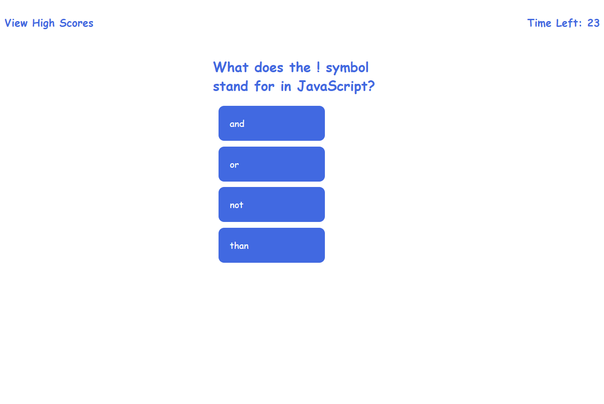

# Description
This webpage was created to allow a user to take a javascript quiz.  The HTML is dynamic and entirely coded in JavsScript allowing the page to render different HTML as the user goes through the different phases of taking the quiz.
# Usage
There ar 4 main stages to the webpage.  A start page where user can get information about taking the quiz.  If the user clicks on the start button they are taken to the quiz stage where they are given questions about Javascript.  They have a set time to complete the quiz.  If they get a question wrong time is deducted from the clock.  The quiz is over when the user answers all the questions or time expires.  When that happens the user is taken to the next phase where they are shown their score and can input their initials to be saved in the high scores.  Once the user enters their initials and clicks the button they are taken to the high score section where high scores are displayed.  The user has the option to clear the high scores or start again.  If they click start again they are taken to the start section of the website where the began and can choose to take the quiz again.

# Screenshot

# URL
[my webpage](https://michaeloc1.github.io/module-4-quiz)
